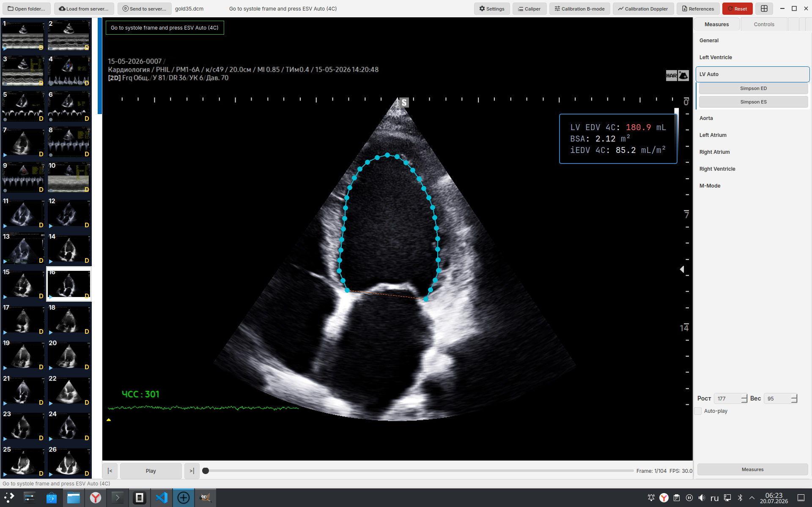
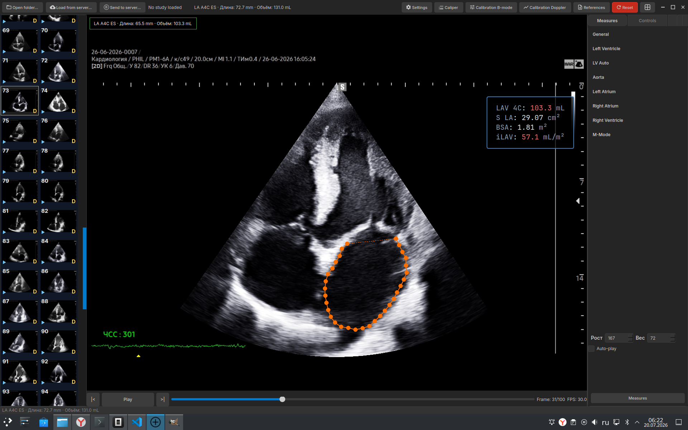
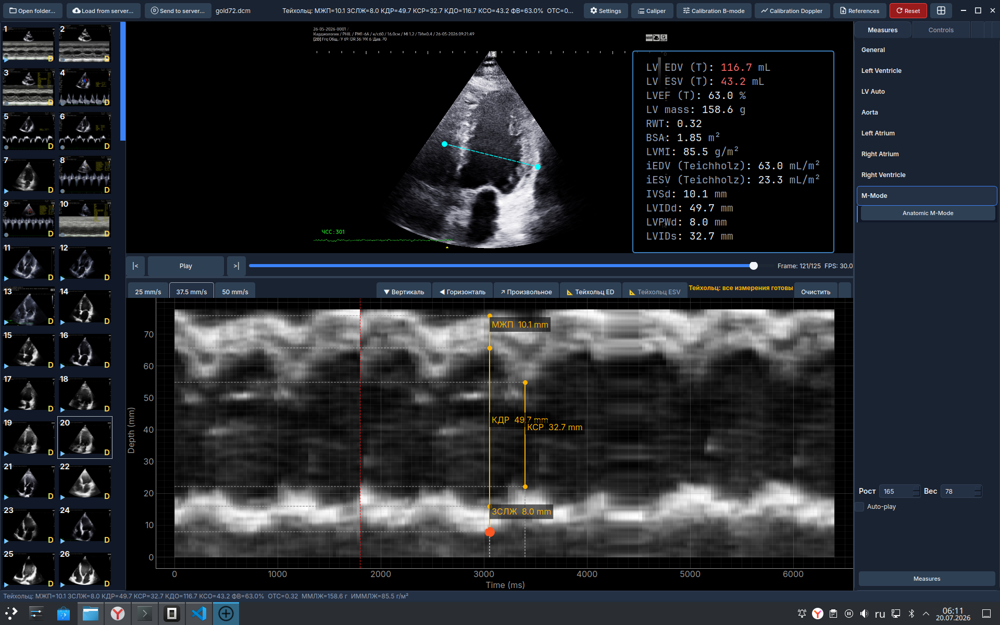

<div align="center">

# SonoForge

### Open-Source Desktop Echocardiography Analysis Platform

[](https://www.python.org/downloads/)
[](LICENSE)
[](https://github.com/areatu/SonoForge/actions)
[](https://github.com/areatu/SonoForge/releases)
[](https://zenodo.org/)

---

**SonoForge** is a free, open-source desktop application for **echocardiography analysis**, **DICOM viewing**, **cardiac measurements**, and **clinical reporting**. Built for cardiologists, sonographers, and researchers who need a powerful, offline-capable tool that complies with **ASE (American Society of Echocardiography) guidelines**.

[🇷🇺 Русская версия](README_RU.md)

[Installation](#installation) · [Features](#features) · [Quick Start](#quick-start) · [Documentation](#documentation) · [Contributing](#contributing)

</div>

---

## 📦 Installation

<details open>
<summary><strong>Linux (.deb) — Recommended</strong></summary>

```bash
# Download latest release
wget https://github.com/areatu/SonoForge/releases/latest/download/sonoforge_*.deb

# Install
sudo dpkg -i sonoforge_*.deb

# Run
sonoforge
```

First run will automatically create a virtual environment, install Python dependencies, and optionally download AI segmentation models.

</details>

<details>
<summary><strong>Windows (.zip)</strong></summary>

1. Download `SonoForge-*.zip` from [Releases](https://github.com/areatu/SonoForge/releases)
2. Extract to any folder
3. Run `SonoForge\bin\SonoForge.bat`

> **Requires:** Python 3.10+ ([download](https://www.python.org/downloads/), check "Add to PATH" during installation)

First run will automatically set up the environment and install all dependencies.

</details>

<details>
<summary><strong>From Source (Development)</strong></summary>

```bash
git clone https://github.com/areatu/SonoForge.git
cd SonoForge

# With uv (recommended)
uv sync --extra dev
uv run sonoforge

# Or pip
pip install -e ".[dev]"
python -m echo_personal_tool
```

</details>

---

## 🚀 Features

SonoForge provides a comprehensive set of tools for **echocardiographic assessment**, from basic measurements to advanced AI-powered analysis.

<div align="center">



*AI-powered LV segmentation with automatic volume calculation*

</div>

### 📊 Cardiac Measurements

| Category | Measurements | Description |
|----------|--------------|-------------|
| **Linear (M-Mode/B-Mode)** | LVEDD, LVESD, IVSd, IVSs, LVPWd, LVPWs, TAPSE, RVOT, LA diameter | Standard ASE linear measurements with real-time caliper labels |
| **Volumetric (Simpson Biplane)** | EDV, ESV, LVEF, LAVi, RAVi | Biplane Simpson's method with open-arc mitral annulus tracking |
| **Doppler (Spectral)** | Mitral inflow (E, A, E/A), TVI, VTI, peak velocities, deceleration time | Full Doppler analysis with automated peak detection |
| **Tissue Doppler (TDI)** | e', a', s', E/e' ratio | Diastolic function assessment per ASE guidelines |
| **M-Mode** | Posterior wall thickness, LV dimensions, fractional shortening | Time-depth measurements with scan line overlay |
| **Strain (STE)** | GLS (Global Longitudinal Strain), segmental strain, AHA 17-segment map | Speckle tracking echocardiography with NCC block-matching |
| **RV Function** | FAC (Fractional Area Change), TAPSE, RV S' | Right ventricular assessment |
| **Diastolic Function** | E/A ratio, E/e', TR velocity, LA volume index | Graded diastolic function assessment (Grade I-III) |
| **LV Mass** | LVM, LVMI (indexed to BSA), RWT (Relative Wall Thickness) | Geometric and anatomical LV mass calculations |
| **Body Surface Area** | DuBois formula, indexed measurements | Automatic BSA indexing for all volume measurements |

### 🤖 AI-Powered Segmentation

SonoForge integrates **ONNX Runtime** for real-time cardiac structure segmentation:

- **LV Auto Segmentation** — Automatic left ventricle contouring in A4C view using EchoNet-Dynamic deep learning model (press `I`)
- **LA Segmentation** — Left atrium cavity segmentation in end-systolic frames
- **Mitral Annulus Detection** — AI-assisted landmark detection for mitral valve annulus
- **Temporal Fusion** — Multi-frame temporal consistency using N±2 neighbor voting for stable contour propagation
- **Active Contour Refinement** — Edge-snapping and gradient-based contour refinement (press `R`)
- **Open-Arc Simpson** — Manual contour initialization with mitral annulus points and apex

<div align="center">



*Left atrium segmentation with automatic volume and BSA-indexed calculation*

</div>

### 🏥 DICOM Integration & PACS Connectivity

Full DICOM connectivity for seamless integration with hospital information systems:

| Protocol | Operations | Description |
|----------|------------|-------------|
| **DICOMweb (WADO-RS)** | QIDO-RS, WADO-RS, STOW-RS | HTTP-based DICOM access (default) |
| **DIMSE (C-FIND)** | Study/Series/Instance search | Query PACS for patient studies |
| **DIMSE (C-GET)** | Single instance retrieval | Download DICOM objects via DIMSE |
| **DIMSE (C-MOVE)** | Bulk series retrieval | Move DICOM objects to embedded Storage SCP |
| **DIMSE (C-STORE)** | DICOM upload | Send local DICOM files to PACS |
| **TLS** | Encrypted associations | Secure DIMSE communication with certificate validation |

**Supported PACS:** Orthanc, DCM4CHEE, Conquest, and any DICOMweb/DIMSE compliant server.

### 📈 Clinical Reporting & Export

- **Study Summary** — Comprehensive report with all measurements, calculations, and indexed values
- **PDF Export** — Clinical-grade PDF reports with patient information, measurements, and reference ranges
- **ASE Reference Norms** — Built-in reference tables for adult echocardiography (age/sex-specific)
- **Structured Reports** — DICOM SR-compatible output
- **Constructor** — Custom reference browser editor with Excel import, PDF/HTML export

### 🎨 User Interface & Experience

- **Dark/Light Theme** — Clinical-friendly color schemes optimized for long reading sessions
- **Dual Viewer** — Side-by-side comparison of different phases or modalities
- **Gallery** — Thumbnail-based study/series navigation
- **Cine Playback** — Smooth DICOM cine loop with variable speed control
- **Window/Level** — Interactive image contrast/brightness adjustment
- **Crosshair** — Spatial reference across synchronized views
- **Keyboard Shortcuts** — Full keyboard navigation for efficient workflow

<div align="center">



*M-Mode with Teichholz measurements: IVSd, LVIDd, LVPWd, LVEF*

</div>

---

## 🏃 Quick Start

### 1. Open DICOM Data

- **Local Folder:** File → Open Folder → Select directory with DICOM/MP4/JPEG files
- **PACS Server:** File → Load from Server → Select Orthanc/DICOMweb server

### 2. Navigate Studies

- **Gallery** → Select series → Frame opens in main viewer
- **Scroll** through cine frames using mouse wheel or keyboard arrows
- **Play/Pause** with `Space` for automated cine loop

### 3. Perform Measurements

| Tool | Key | Description |
|------|-----|-------------|
| Linear Caliper | `L` | Distance measurement (LVEDD, IVSd, TAPSE, etc.) |
| Simpson Biplane | `C` | LV volume measurement (open-arc contour) |
| Doppler Peak | `M` | Spectral Doppler peak velocity |
| Doppler Interval | `T` | Time interval measurement |
| VTI Trace | `V` | Velocity-time integral tracing |
| M-Mode | `M` | M-Mode trace and measurements |
| Speckle Tracking | `STE` | GLS and strain analysis |

### 4. View Results

- **Results Panel** — All measurements with indexed values (BSA, age/sex-corrected)
- **PDF Export** — Generate clinical report
- **DICOM SR** — Save structured report to PACS

---

## 📚 Documentation

| Document | Description |
|----------|-------------|
| [SECURITY.md](SECURITY.md) | PHI handling, data security, model integrity, HIPAA considerations |
| [CONTRIBUTING.md](CONTRIBUTING.md) | Contribution guidelines, code style, testing |
| [ROADMAP.md](ROADMAP.md) | Feature status and development roadmap |
| [docs/superpowers/specs/](docs/superpowers/specs/) | Technical specifications (STE, DICOMweb, M-Mode, etc.) |
| [docs/superpowers/plans/](docs/superpowers/plans/) | Implementation plans and sprint backlogs |
| [docs/bench/](docs/bench/) | Performance benchmarks |

---

## 🏗️ Architecture

SonoForge follows **Clean Architecture** principles with clear separation of concerns:

```
src/echo_personal_tool/
├── domain/              # Business logic (no Qt dependency)
│   ├── models/          # Data models: Contour, Doppler, Speckle, MMode
│   ├── calculations/    # Cardiac calculations: Simpson, Bernoulli, Teichholz
│   └── services/        # Segmentation, tracking, reference data
├── infrastructure/      # External integrations
│   ├── dicom_*.py       # DICOM reading/writing (pydicom)
│   ├── orthanc_*.py     # DICOMweb client (httpx)
│   ├── dimse_*.py       # DIMSE client (pynetdicom)
│   ├── onnx_engine.py   # ONNX inference engine
│   └── server_settings.py # Server connection management
├── application/         # Orchestration layer
│   ├── app_controller.py # Main application controller
│   ├── workers/         # Background workers (11 parallel tasks)
│   └── services/        # Application services
├── presentation/        # GUI layer (PySide6/Qt)
│   ├── main_window.py   # Main application window
│   ├── viewer_widget.py # DICOM image viewer
│   ├── doppler_widget.py # Spectral Doppler display
│   └── ...              # 30+ UI components
├── constructor/         # Reference browser editor
└── resources/           # Fonts, icons, ASE reference data
```

---

## 🛡️ Security & Privacy

> **Your data stays local.** SonoForge processes all DICOM data in memory — no PHI (Protected Health Information) is written to disk, no cloud uploads, no telemetry, no analytics.

### Security Features

- ✅ **DICOM File Validation** — Validates file integrity before parsing (magic bytes, size limits)
- ✅ **Model Integrity** — SHA256 verification for ONNX AI models at load time
- ✅ **Network Timeouts** — Configurable timeouts for DICOMweb/DIMSE connections
- ✅ **PHI Sanitization** — Patient identifiers truncated in log files
- ✅ **In-Memory Processing** — All DICOM data processed in RAM, no temp files
- ✅ **No Cloud Dependencies** — Works fully offline after installation

See [SECURITY.md](SECURITY.md) for detailed security documentation.

---

## 🤝 Contributing

We welcome contributions from the medical imaging and cardiology community! See [CONTRIBUTING.md](CONTRIBUTING.md) for guidelines.

### Development Setup

```bash
# Install development dependencies
pip install -e ".[dev]"

# Run tests
python -m pytest tests/

# Lint
ruff check src tests

# Format
ruff format src tests
```

### Areas for Contribution

- 🩺 New measurement tools (3D echo, strain rate, etc.)
- 🤖 Additional AI models (RV segmentation, valve detection)
- 🌐 Localization (i18n) for different languages
- 📊 Additional reference databases
- 🐛 Bug fixes and performance improvements

---

## 📜 Citation

If you use SonoForge in your research or clinical practice, please cite:

```bibtex
@software{kuvilkin2026sonoforge,
  author       = {Kuvilkin, Vitaliy},
  title        = {SonoForge: Open-Source Desktop Echocardiography Analysis Platform},
  year         = {2026},
  publisher    = {GitHub},
  url          = {https://github.com/areatu/SonoForge},
  license      = {GPL-3.0}
}
```

---

## 📄 License

[GPL-3.0](LICENSE) — Free software, open source. You are free to use, modify, and distribute this software.

---

<div align="center">

**Built with ❤️ for cardiologists, sonographers, and researchers**

[Report Bug](https://github.com/areatu/SonoForge/issues) · [Request Feature](https://github.com/areatu/SonoForge/issues) · [Discussions](https://github.com/areatu/SonoForge/discussions)

</div>
