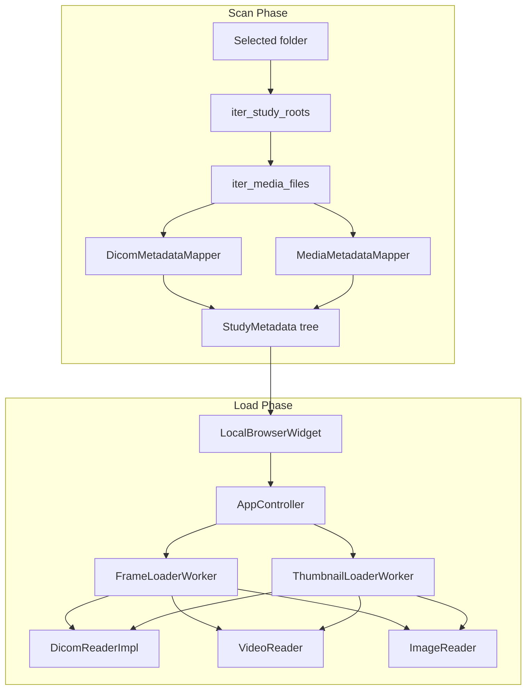

# Sprint 3.1 — JPEG and MP4 Format Support

**Фаза:** 1  
**Предшественник:** Sprint 3 (DopplerWidget)  
**Статус:** Реализован  
**Scope:** [`Этап 1.md`](Этап%201.md) §2.1 — `DICOM + MP4 + JPEG/PNG`

---

## 1. Цель

Закрыть data layer Фазы 1 для форматов **MP4** и **JPEG/PNG**: файлы с УЗ-аппарата (режимы экспорта DICOM/MP4 и JPEG/MP4) обнаруживаются сканером, группируются в дереве исследований, отображаются в 2D viewer с thumbnails.

---

## 2. Контекст и ограничения

### Структура экспорта с аппарата

Одна папка на исследование, файлы лежат вместе (flat mixed), без вложенных подпапок по сериям:

- **DICOM/MP4** — DICOM-кадры/серии + MP4 cine
- **JPEG/MP4** — JPEG stills + MP4 cine

### Клинические ограничения

| Формат | Viewer | Playback | PixelSpacing | Doppler (S3) |
|---|---|---|---|---|
| DICOM | ✅ | ✅ (multi-frame) | из DICOM | ✅ |
| MP4 | ✅ | ✅ | ❌ (ручная калибровка) | ❌ |
| JPEG/PNG | ✅ | ❌ (1 кадр) | ❌ (ручная калибровка) | ❌ |
| MP4/JPEG color | ✅ BGR→RGB в viewer | ✅ | — | — |

MP4/JPEG отображаются в **цвете** (важно для Color Doppler). DICOM по-прежнему grayscale.

MP4/JPEG не содержат DICOM Waveform Sequence — допплер-измерения на них **не поддерживаются**.

---

## 3. Архитектура



### Новые компоненты

| Модуль | Назначение |
|---|---|
| `infrastructure/media_formats.py` | Определение формата по расширению |
| `infrastructure/image_reader.py` | JPEG/PNG → grayscale uint8 (OpenCV) |
| `infrastructure/media_metadata_mapper.py` | Synthetic UID, MP4 probe, image metadata |

### Изменённые компоненты

| Модуль | Изменение |
|---|---|
| `infrastructure/local_scanner.py` | `LocalMediaDirectoryScanner`, folder-first grouping |
| `domain/models/metadata.py` | `InstanceMetadata.media_format` |
| `application/workers/frame_loader_worker.py` | Маршрутизация по `media_format` |
| `application/workers/thumbnail_loader_worker.py` | Thumbnails для всех форматов |
| `application/app_controller.py` | Загрузка по `media_format` |
| `presentation/local_browser.py` | Labels: filename для non-DICOM |
| `presentation/main_window.py` | «Select study folder» |

---

## 4. Алгоритм группировки

### Определение study-папок

```
если в root нет медиа-файлов, но есть подпапки с медиа:
    каждая подпапка = отдельное исследование
иначе:
    root = одно исследование (рекурсивный обход)
```

### Внутри study-папки

- **DICOM** — группировка по `SeriesInstanceUID` (как раньше)
- **MP4** — серия `"Cine (MP4)"`, один instance на файл
- **JPEG/PNG** — серия `"Still (JPEG)"`, один instance на файл

**study_uid:** из DICOM в папке; если DICOM нет — `local:{sha256(folder)[:16]}`  
**study_datetime:** `StudyDate+StudyTime` из DICOM; иначе mtime папки  
**Synthetic instance UID:** стабильный hash от `(study_folder, filename)`

---

## 5. Чеклист задач

### Этап A — Infrastructure readers

- [x] `media_formats.py`
- [x] `image_reader.py` + unit-тесты
- [x] `media_metadata_mapper.py` + unit-тесты
- [x] `IImageReader` в `domain/ports.py`

### Этап B — Scanner refactor

- [x] `LocalMediaDirectoryScanner` (folder-first)
- [x] Unit-тесты: mixed folder, MP4-only, multi-study root
- [x] Alias `LocalDicomDirectoryScanner` для обратной совместимости

### Этап C — Load pipeline

- [x] `FrameLoaderWorker` — jpeg/png/mp4/dicom
- [x] `ThumbnailLoaderWorker` — все форматы
- [x] `AppController` — `media_format`
- [x] `InstanceMetadata.media_format` в mapper

### Этап D — UI + docs

- [x] `LocalBrowserWidget` labels
- [x] `MainWindow` тексты
- [x] `Sprint3.1.md`
- [x] `README.md`, `Этап2.md` §13

### Этап E — Верификация

- [x] `uv run pytest`
- [ ] Ручная проверка Tier 1 экспортов с аппарата (DICOM/MP4 и JPEG/MP4)

---

## 6. Критерии приёмки

1. Открытие папки с DICOM + MP4 показывает все файлы в одном study
2. MP4 воспроизводится (play/pause, timeline)
3. JPEG/PNG открывается как один кадр
4. Thumbnails отображаются для DICOM, MP4, JPEG, PNG
5. Папка-контейнер с несколькими study-подпапками показывает несколько исследований
6. Все unit/integration тесты проходят

---

## 7. Out of scope

- Heuristic linking MP4 filename ↔ DICOM series
- EXIF datetime в JPEG
- Color mode preservation (всё → grayscale)
- Doppler на MP4/JPEG
- Sidecar JSON/metadata от аппарата

---

## 8. Тесты

| Файл | Покрытие |
|---|---|
| `tests/unit/test_image_reader.py` | JPEG/PNG decode |
| `tests/unit/test_media_metadata_mapper.py` | Synthetic UID, MP4 metadata |
| `tests/unit/test_local_media_scanner.py` | Mixed folder, study roots |
| `tests/unit/test_frame_loader_worker.py` | Media routing |
| `tests/fixtures/generate_synthetic_media.py` | Synthetic MP4/JPEG/PNG |
