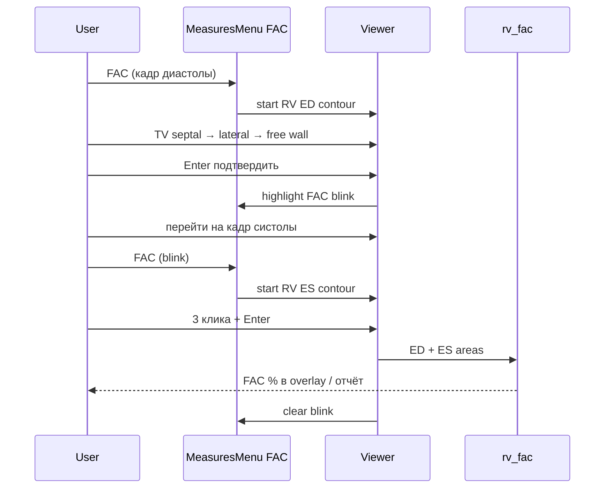

# RV FAC — дизайн (2026-06-22)

**Статус:** implemented (2026-06-22)  
**Связано:** `rv_fac.py`, `measures_menu.py`, Simpson manual open-arc, blink workflow

---

## Решения

| Тема | Решение |
|------|---------|
| **S ПП** | Закрыто. Площадь ПП — через RAV 4C (Simpson open-arc), отдельной кнопки нет. |
| **FAC** | Одна кнопка «FAC» в блоке Right Ventricle. |
| **Метрика** | Только площадь контура (мм²); объём Simpson для RV FAC не считается. |
| **Формула** | `FAC = (EDA − ESA) / EDA × 100%` — без изменений (`rv_fac.py`). |

---

## UX workflow

1. Пользователь на **диастолическом** кадре A4C нажимает **FAC**.
2. Контур RV **ED**: 3 клика (как LV Simpson manual) → шаблон → редактирование узлов / R-refine → **Enter** подтверждение.
3. Кнопка **FAC мигает** (тот же паттерн, что `highlight_action` после All Diastole).
4. Пользователь переходит на **систолический** кадр, снова нажимает **FAC**.
5. Контур RV **ES** — тот же сценарий.
6. После подтверждения ES: **FAC %** в frame/study overlay и отчёте; мигание прекращается.

**Состояние сессии:** флаг `_rv_fac_awaiting_es` (или эквивалент в `MainWindow`): после ED без ES — повторный клик FAC запускает только ES; при сбросе измерений — сброс флага.

---

## Контур и шаблон

### Landmarks (как LV Simpson manual)

1. **TV septal** — прикрепление к перегородке  
2. **TV lateral** — латеральное прикрепление  
3. **Free wall / apex** — точка на свободной стенке ПЖ  

### Шаблон: четверть синусоиды

Новая функция `warp_rv_quarter_sine_open_arc(septal, lateral, apex)` в `rv_shape_template.py` (или расширение `lv_shape_template.py`):

- Локальная система: хорда TV = верхняя грань; **septal** — правая опора, **lateral** — левая.
- **Правая (септальная) сторона:** прямой отрезок septal → к зоне apex (усечение справа).
- **Левая (свободная стенка):** четверть периода синусоиды от lateral к apex — закругление слева.
- **Низ:** усечение по уровню apex (не полный эллипс / не Lamé).
- Ресемплинг: `resample_open_arc_landmarks` (как LV/LA).

### Наследуем от Simpson manual

| Возможность | RV FAC |
|-------------|--------|
| Drag узлов / группа | да |
| R — stepped border refine + edge snap | да (`refine_open_arc_contour`, chamber=RV) |
| Lamé / elliptical template | **нет** — только quarter-sine |
| Объём Simpson в overlay | **нет** — только площадь мм² |

### Площадь

- Open-arc + хорда TV → `closed_polygon_points()` → `polygon_area_mm2` (уже в `from_rv_contours`).
- Overlay после каждого контура: `RV ED area: … mm²` / `RV ES area: … mm²`; после ES дополнительно `FAC: … %`.

---

## Изменения в коде (обзор)

| Файл | Изменение |
|------|-----------|
| `domain/services/rv_shape_template.py` | **новый** — `warp_rv_quarter_sine_open_arc` |
| `domain/services/mbs_lite_service.py` | `fit_contour_from_landmarks` + refine path для `chamber=RV` |
| `presentation/viewer_widget.py` | RV: убрать stage `arc` (ручные точки); 3 клика → шаблон как LV |
| `presentation/measurement_action.py` | `RV_FAC` вместо `RV_FAC_ED` / `RV_FAC_ES` |
| `presentation/measures_menu.py` | кнопка «FAC» в Right Ventricle |
| `presentation/main_window.py` | `_on_rv_fac`, blink в `_on_contour_completed`, wiring |
| `ROADMAP.md` | S ПП закрыто; FAC — одна кнопка + quarter-sine |
| тесты | `test_rv_shape_template.py`, blink/FAC workflow, обновить action tests |

---

## Критерии готовности

- [ ] Кнопка FAC в меню ПЖ; нет отдельных ED/ES кнопок.
- [ ] ED контур → blink FAC → ES контур → FAC % в overlay.
- [ ] Шаблон: 3 клика, не Lamé; R-refine работает.
- [ ] Overlay/отчёт: площади ED/ES и FAC %; без объёма RV.
- [ ] S ПП не добавляется; RAV 4C без изменений по этой спеки.
- [ ] Unit-тесты шаблона и `from_rv_contours` проходят.

---

## Вне scope

- ONNX auto для RV  
- Biplane RV  
- Отдельная кнопка S ПП  
