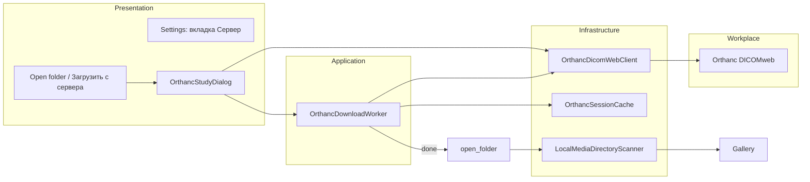

# DICOMweb (Orthanc) — загрузка серий для анализа

**Статус:** implemented (2026-06-23)  
**Дата:** 2026-06-23  
**Источники:** `DICOM_parsing.md`, `orthanc_analysis.md`  
**Scope v1:** QIDO-RS + WADO-RS, **без STOW-RS**

---

## Цель

Загружать выбранные DICOM-серии с Orthanc (DICOMweb) в локальный **сессионный** кэш и открывать их в существующем viewer через `AppController.open_folder()` — без дублирования парсера DICOM.

Сервер на работе (`192.168.1.111:8042`); разработка дома — через **mock/fixtures**, без живого Orthanc.

---

## Архитектура



**Принцип:** скачанные `.dcm` лежат в папке, совместимой с `iter_study_roots()` / `iter_media_files()`; после загрузки вызывается уже существующий `ScanWorker`.

---

## Компоненты

| Компонент | Файл | Ответственность |
|-----------|------|-----------------|
| `OrthancDicomWebClient` | `infrastructure/orthanc_client.py` | HTTP: QIDO-RS, WADO-RS, ping; парсинг `application/dicom+json` |
| `OrthancSessionCache` | `infrastructure/orthanc_cache.py` | Сессионная temp-папка, запись инстансов, очистка |
| `OrthancDownloadWorker` | `application/workers/orthanc_download_worker.py` | `QRunnable`: серии → WADO → кэш, прогресс |
| `OrthancStudyDialog` | `presentation/orthanc_study_dialog.py` | Поиск, дерево study/series, выбор, прогресс |
| `ServerSettings` | `presentation/server_settings.py` или вкладка в settings | URL, login, password, режим mock |
| DTO | `domain/models/orthanc.py` | `StudyInfo`, `SeriesInfo`, `InstanceInfo` |

### OrthancDicomWebClient

```text
GET  /system                          → ping
GET  /dicom-web/studies?PatientName=* → query_studies
GET  /dicom-web/studies/{uid}/series   → query_series
GET  /dicom-web/studies/{uid}/series/{uid}/instances → query_instances
GET  /dicom-web/studies/{uid}/series/{uid}/instances/{uid}
     Accept: application/dicom         → download_instance (bytes)
```

- **HTTP-клиент:** `httpx.Client` (sync, Basic Auth, timeout 30s, keep-alive).
- **Парсинг JSON:** DICOMweb возвращает массив объектов с тегами как `{"00100010": {"vr": "PN", "Value": ["..."]}}` — вынести в `orthanc_dicom_json.py` (чистые функции, unit-тестируемые).
- **Интерфейс:** абстрактный `DicomWebClient` protocol для подмены mock в тестах.

### OrthancSessionCache

**Не** персистентный `inventory.json` между сессиями (уточнение из `DICOM_parsing.md`).

```text
{cache_root}/session-{uuid}/
  {StudyInstanceUID}/
    {SeriesInstanceUID}/
      {SOPInstanceUID}.dcm
```

- `cache_root` по умолчанию: `~/.echo-personal-tool/orthanc` (только контейнер).
- `create_session()` → новая `session-{uuid}/`.
- `clear_session()` при выходе из приложения (`MainWindow.closeEvent` или `AppController.shutdown`).
- `study_path(study_uid) → Path` для `open_folder(study_path)` **одного** исследования (не весь кэш).

### OrthancStudyDialog

1. `ping()` → статус «сервер ✔ / недоступен».
2. `query_studies(patient_name?)` → список (дата, пациент, описание, StudyUID).
3. Раскрытие study → lazy `query_series`.
4. Чекбоксы серий; оценка объёма (число instances из QIDO).
5. «Загрузить» → `OrthancDownloadWorker` на `QThreadPool`.
6. `done(study_uid)` → `open_folder(cache.study_path(study_uid))`, закрытие диалога.

Фильтр модальности US в UI (опционально v1.1); на сервере все данные US.

### Настройки (QSettings)

| Ключ | Default |
|------|---------|
| `server/url` | `http://192.168.1.111:8042` |
| `server/username` | `pacs` |
| `server/password` | plain text (локально) |
| `server/use_mock` | `true` когда сервер недоступен (авто или ручной переключатель) |

**Безопасность:** `orthanc_analysis.md` с паролем — в `.gitignore`; в репозиторий не коммитить. Пример credentials только в локальной доке.

---

## Режим разработки без сервера (рекомендация)

Три подхода; **рекомендуем A + C:**

| | A. Mock client | B. httpx MockTransport | C. Recorded JSON |
|---|----------------|------------------------|------------------|
| Суть | `FakeDicomWebClient` реализует protocol | Подмена HTTP в тестах | Фикстуры из curl с работы |
| Дома | ✅ UI + worker без сети | ✅ unit-тесты клиента | ✅ реалистичный парсинг JSON |
| На работе | — | smoke с живым URL | обновить фикстуры |
| Сложность | низкая | средняя | низкая |

**План:**

1. Записать на работе 3–5 JSON-ответов в `tests/fixtures/orthanc/` (studies, series, instances — anonymized).
2. `FakeDicomWebClient` читает фикстуры; «скачивание» копирует `tests/fixtures/dicom/*.dcm` (синтетика уже есть в проекте).
3. Переключатель «Использовать mock» в настройках или авто-fallback: если `ping()` fail → mock + предупреждение в статус-баре.

---

## Интеграция с UI

- **SystemBar:** кнопка `Загрузить с сервера…` рядом с `Open folder…`.
- **Settings:** вкладка «Сервер» (URL, логин, пароль, mock).
- После загрузки: `controller.open_folder(study_cache_path)` — как в `DICOM_parsing.md`.

---

## Зависимости

```toml
"httpx>=0.27"
```

Опционально `httpcore` идёт транзитивно. Без asyncio в UI-потоке.

---

## Обработка ошибок

| Ситуация | Поведение |
|----------|-----------|
| Сервер недоступен | Диалог: «Сервер недоступен» + предложение mock (дома) |
| 401/403 | «Неверный логин/пароль» |
| Таймаут WADO | retry 1×; иначе `failed` с series_uid |
| Битый DICOM | `scan_errors.log` в папке study (как локальный скан) |
| Отмена | флаг cancel в worker; частичный кэш session удаляется |

---

## Тестирование

| Уровень | Что |
|---------|-----|
| Unit | парсер dicom+json; cache paths; FakeClient |
| Unit | OrthancDownloadWorker с FakeClient + temp dir |
| Integration | опционально `@pytest.mark.integration` + VPN на работе |
| Manual | OrthancStudyDialog + mock на дому |

---

## Вне scope v1

- STOW-RS (загрузка на сервер)
- Потоковое WADO без полного скачивания
- Параллельная загрузка >N инстансов (можно v1.1, сначала последовательно)
- C-STORE / DIMSE
- Долговременный кэш между сессиями

---

## Критерии готовности v1

- [x] Настройки сервера сохраняются в QSettings
- [x] Диалог: список studies, выбор series, прогресс загрузки
- [x] Mock-режим работает без сети
- [x] После загрузки gallery показывает серии как при Open folder
- [x] Сессионный кэш очищается при выходе
- [x] Unit-тесты парсера и worker (mock)
- [x] `httpx` в `pyproject.toml`

---

## Расхождение с старыми доками

`Этап2.md` / `Общий план.md` исключали DICOMweb — **осознанно расширяем** scope для личного инструмента с workplace Orthanc. STOW — отдельная фаза.

---

## Workplace fixture capture (when server available)

Записать anonymized JSON-ответы с workplace Orthanc для обновления `tests/fixtures/orthanc/`:

```bash
# Save fixtures (replace UID and credentials as needed)
curl -u "user:pass" -H "Accept: application/dicom+json" \
  "http://192.168.1.111:8042/dicom-web/studies?limit=5" \
  > tests/fixtures/orthanc/studies.json

curl -u "user:pass" -H "Accept: application/dicom+json" \
  "http://192.168.1.111:8042/dicom-web/studies/{StudyUID}/series" \
  > tests/fixtures/orthanc/series.json

curl -u "user:pass" -H "Accept: application/dicom+json" \
  "http://192.168.1.111:8042/dicom-web/studies/{StudyUID}/series/{SeriesUID}/instances" \
  > tests/fixtures/orthanc/instances.json
```
