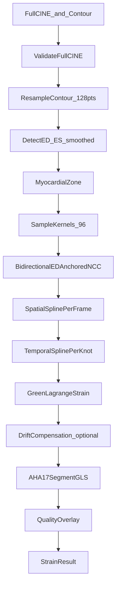

# STE Clinical Parity — Design Specification

**Date:** 2026-06-27  
**Status:** Approved (Strategy 1)  
**Type:** Feature design  
**Domain:** Echocardiography — 2D speckle tracking (STE)  
**Supersedes:** Partial alignment with `2026-06-24-speckle-tracking-strain.md` (NCC baseline retained; post-processing pipeline replaced)

---

## 1. Executive Summary

Current STE is **forward-only NCC block matching** with minimal post-processing. Commercial systems (Standard, Research 2D CPA, Philips Clinical) achieve clinical repeatability through a **standard post-tracking pipeline**: bidirectional ED-anchored tracking, spatial/temporal spline smoothing with quality weights, drift compensation, Green–Lagrange strain, AHA segment aggregation, and mandatory quality visualization.

**Strategy 1 — Clinical Parity Patch:** implement Tier A methods (A1–A8) plus determinism prerequisites. No ML, no RF, no TDA. Target: GLS std dev < 0.5% on 10 repeated runs with identical inputs.

---

## 2. Goals and Non-Goals

### 2.1 Goals

| Goal | Success criterion |
|------|-------------------|
| Repeatability | Same DICOM + same contour → GLS σ < 0.5% over 10 runs |
| Predictability | Documented config presets; deterministic kernel placement |
| Manageability | Per-kernel/segment quality scores visible; drift comp toggle |
| Clinical alignment | Green–Lagrange strain; AHA 17-segment GLS; ASE/EACVI QC |

### 2.2 Non-Goals (this milestone)

- Optical flow as primary tracker (Esaote-style)
- 3D / multi-view fusion (A2C, A3C)
- Deep learning (NELAFO, EchoTracker)
- TDA (persistent homology)
- RF tracking
- Tier B enhancements (iterative BM, Hamming, LK cross-check) — deferred to Strategy 2

---

## 3. Current State Diagnosis

### 3.1 Pipeline gaps vs commercial STE

```
Current:  contour → kernels → forward NCC → MAD → chord strain → argmin GLS
Target:   contour → resample → ED/ES → kernels → bidirectional ED-anchored NCC
          → spatial spline → temporal spline → Green–Lagrange → drift comp
          → AHA segments → QC overlay
```

### 3.2 Determinism bugs (prerequisite)

1. **`FrameCache.frames`** returns partial stack when frames evicted — breaks temporal indexing.
2. **`strain_computation.py`** fallback uses `displacements[:n_kernels]` without layer indices.
3. **Contour point count** varies with user drawing → different kernel placement.
4. **`SpeckleConfig`** hardcoded in `app_controller.py`; no presets.

---

## 4. Target Architecture



### 4.1 Layer responsibilities

| Module | Responsibility |
|--------|----------------|
| `frame_cache.py` | Guarantee full cine for STE; raise if incomplete |
| `contour_utils.py` (new) | Arc-length resample contour to fixed N points |
| `cardiac_cycle_detector.py` | Smoothed ED/ES; ROI-masked HR |
| `speckle_tracking.py` | ED-anchored bidirectional NCC |
| `tracking_smoothing.py` (new) | Spatial + temporal cubic splines with NCC weights |
| `strain_computation.py` | Green–Lagrange on arc-length; AHA segments; drift comp |
| `aha_segments.py` (new) | Kernel → AHA segment mapping (apical 4-ch) |
| `speckle_worker.py` | Orchestrate new pipeline |
| `speckle_overlay.py` | Quality heatmap, segment scores, drift comp indicator |
| `strain_curve_widget.py` | Wire to main window; show GLS + segment table |

All domain modules remain **pure functions** — no PySide6 in `domain/`.

---

## 5. Tier A Method Specifications

### A1 + A2: Bidirectional ED-Anchored Tracking

**Reference frame:** ED frame (index `ed_index`), detected before tracking.

**Per target frame `t`:**

1. Build Gaussian pyramids for `frames[ed_index]` and `frames[t]`.
2. For each kernel at ED position `p_ed`:
   - **Forward path:** `match(ed → t)` starting search at interpolated position from previous frame (warm start only).
   - **Backward path:** `match(t → ed)` — template from frame `t`, search in frame `ed` (inverse displacement).
3. **Fusion:** if both valid (NCC ≥ threshold):
   - Forward: template at ED, match in frame `t` → position `p_fwd`, NCC `w_fwd`
   - Backward: template at frame `t` (at forward-predicted position), match in ED → inverse displacement → position `p_bwd`, NCC `w_bwd`
   - `p_final = (w_fwd * p_fwd + w_bwd * p_bwd) / (w_fwd + w_bwd)`
4. If only one valid → use that; if neither → mark invalid, interpolate later in spline stage.

**New API:**

```python
def track_cine_bidirectional(
    frames: np.ndarray,
    initial_kernels: list[TrackingKernel],
    ed_index: int,
    config: SpeckleConfig,
    progress_callback: Callable[[int, int], None] | None = None,
) -> list[TrackingResult]:
    """Track all frames relative to ED. Returns (n_frames,) results; result[0] is identity."""
```

`track_cine()` retained as thin wrapper calling bidirectional with `ed_index=0` for backward compatibility in tests.

### A3: Spatial + Temporal Spline Smoothing

**Input:** raw positions `(n_frames, n_kernels, 2)` and NCC scores `(n_frames, n_kernels)`.

**Spatial (per frame, per layer ring):**
- Order kernels by `node_index` along endo/epi contour.
- Fit periodic cubic spline through `(x, y)` parameterized by arc-length index.
- Smoothing factor `s_spatial[k] = base_spatial * (1 - ncc[k])` — low NCC → more smoothing.
- Apply separately per ring (`endo`, `mid`, `epi`).

**Temporal (per kernel):**
- For each kernel `k`, spline `(x(t), y(t))` over frames.
- `s_temporal[k] = base_temporal * mean(1 - ncc[:, k])`.
- Invalid frames: interpolate from neighbors before temporal smooth.

**Config:**

```python
spatial_smoothing: float = 1.0   # 0=off, 1=vendor default, 2=heavy
temporal_smoothing: float = 1.0
quality_weighted_smoothing: bool = True
```

**Library:** `scipy.interpolate.CubicSpline` with smoothing parameter `s`.

### A4: Drift Compensation

After longitudinal strain curve `ε(t)` computed:

```python
def apply_drift_compensation(strain: np.ndarray, ed_index: int, n_frames: int) -> np.ndarray:
    """Linear detrend so strain[ed_index] == strain[ed_index_at_cycle_end] == 0."""
```

- Applied only when `config.drift_compensation=True` (default **True**).
- UI shows badge: `Drift comp: ON/OFF`.
- ASE/EACVI: user must be able to toggle.

### A5: Green–Lagrange Strain

Replace engineering strain `(L - L₀) / L₀` with:

$$E_{LL} = \frac{1}{2}\left[\left(\frac{L(t)}{L(ED)}\right)^2 - 1\right] \times 100\%$$

- `L(t)` = arc-length of smoothed endo contour at frame `t`.
- Arc-length via cumulative Euclidean sum along resampled contour points (128 pts).

### A6: AHA 17-Segment Aggregation

**Apical 4-ch view mapping** (simplified 6 segments visible):

| Segment | Angular range (degrees from apex) |
|---------|-----------------------------------|
| Basal septal | 300–360, 0–60 |
| Basal lateral | 60–120 |
| Mid septal | 120–180 |
| Mid lateral | 180–240 |
| Apical septal | 240–300 |
| Apical lateral | (merged into apical cap) |

**GLS computation:**

```python
segment_strain[seg] = min(E_LL[k] for k in kernels if k.segment == seg and k.quality_ok)
gls = mean(segment_strain.values())  # or min for conservative
```

Store `segment_strain: dict[int, float]` and `segment_quality: dict[int, float]` in `StrainResult`.

### A7: Quality Metrics + QC Workflow

**Per-kernel quality:** `quality[k] = mean(ncc_scores[:, k])` clamped [0, 1].

**Per-segment quality:** mean of kernel qualities in segment.

**Auto-reject:** segment with `quality < config.min_segment_quality` (default 0.4) excluded from GLS.

**UI (`SpeckleOverlay`):**
- Kernels colored by NCC: green (≥0.7), yellow (0.5–0.7), red (<0.5).
- Segment quality panel (new `QWidget` in `main_window`): table of 6 segments with strain % and quality bar.
- Tracking overlay always visible during cine playback (ASE/EACVI requirement).

### A8: Multi-Cycle Averaging

1. Detect cycle boundaries via smoothed endo area minima/maxima or HR-based frame count.
2. If ≥ 2 complete cycles detected:
   - Run tracking per cycle (ED = cycle start).
   - Resample each cycle strain curve to normalized phase [0, 1] with 100 points.
   - Average curves; map back to frame indices using first cycle timing.
3. If only 1 cycle → single-cycle path (current behavior).

---

## 6. Determinism Prerequisites

### 6.1 Frame cache

```python
def require_full_cine(self) -> np.ndarray:
    """Return full (N,H,W) stack or raise IncompleteCineError."""
    if len(self._frame_store) != self._total_frames:
        raise IncompleteCineError(
            f"Only {len(self._frame_store)}/{self._total_frames} frames loaded. "
            "Reload full cine before speckle tracking."
        )
    return np.stack([self._frame_store[i] for i in range(self._total_frames)])
```

`app_controller.run_speckle_tracking()` calls `require_full_cine()` instead of `.frames`.

### 6.2 Contour normalization

```python
def resample_contour(points: np.ndarray, n_points: int = 128) -> np.ndarray:
    """Uniform arc-length resampling. Deterministic for same input polyline."""
```

Called in `create_myocardial_zone()` before zone expansion.

### 6.3 Strain fallbacks

Remove `displacements[:n_kernels]` fallback. If positions missing → raise `TrackingIncompleteError` or use spline-interpolated positions from smoothing stage only.

---

## 7. Configuration Schema

### 7.1 Extended `SpeckleConfig`

```python
@dataclass(frozen=True)
class SpeckleConfig:
    # Tracking (existing)
    kernel_size: int = 20
    search_radius: int = 20
    pyramid_levels: int = 2
    ncc_threshold: float = 0.5
    outlier_sigma: float = 3.0
    subpixel: bool = True
    wall_thickness_mm: float = 8.0

    # New — pipeline
    bidirectional: bool = True
    ed_anchored: bool = True
    spatial_smoothing: float = 1.0
    temporal_smoothing: float = 1.0
    quality_weighted_smoothing: bool = True
    drift_compensation: bool = True
    min_segment_quality: float = 0.4
    multi_cycle_average: bool = True
    contour_resample_points: int = 128

    @classmethod
    def preset_standard(cls) -> SpeckleConfig:
        return cls(
            kernel_size=20, search_radius=20,
            spatial_smoothing=1.0, temporal_smoothing=1.0,
            drift_compensation=True,
        )

    @classmethod
    def preset_tomtec(cls) -> SpeckleConfig:
        return cls(
            kernel_size=18, search_radius=18,
            spatial_smoothing=1.2, temporal_smoothing=1.1,
            drift_compensation=True,
        )

    @classmethod
    def preset_debug(cls) -> SpeckleConfig:
        return cls(
            bidirectional=False, spatial_smoothing=0.0,
            temporal_smoothing=0.0, drift_compensation=False,
        )
```

Default in production: `SpeckleConfig.preset_standard()`.

### 7.2 Extended `StrainResult`

```python
@dataclass(frozen=True)
class StrainResult:
    # existing fields ...
    segment_strain: dict[int, float] = field(default_factory=dict)
    segment_quality: dict[int, float] = field(default_factory=dict)
    drift_compensation_applied: bool = False
    tracking_quality_mean: float = 0.0
    cycle_count: int = 1
    config_preset: str = "standard"
```

### 7.3 Extended `TrackingKernel`

```python
@dataclass(frozen=True)
class TrackingKernel:
    center: tuple[float, float]
    radius: int = 10
    node_index: int = 0
    layer: str = "endo"
    aha_segment: int = 0          # 1–17, 0=unassigned
    arc_length_param: float = 0.0  # [0, 1] along contour
```

---

## 8. Worker Pipeline (New Order)

```python
def run(self) -> None:
    config = self._config or SpeckleConfig.preset_standard()
    resampled_endo = resample_contour(self._zone.endo_points, config.contour_resample_points)
    zone = replace_zone_endo(self._zone, resampled_endo)
    kernels = sample_kernels_in_zone(zone)
    kernels = assign_aha_segments(kernels, zone, view="A4C")

    # Preliminary ED/ES from area on ED contour (before tracking)
    ed_index, es_index = detect_ed_es_from_frames(self._frames, zone, config)

    tracking_results = track_cine_bidirectional(
        self._frames, kernels, ed_index, config, ...
    )
    positions, ncc_matrix = extract_trajectories(tracking_results, kernels)
    smoothed = smooth_trajectories(positions, ncc_matrix, kernels, config)

    longitudinal = compute_longitudinal_strain_gl(smoothed, kernels, ed_index, ...)
    if config.drift_compensation:
        longitudinal = apply_drift_compensation(longitudinal, ed_index, n_frames)

    segment_strain, segment_quality = compute_aha_segment_strain(...)
    gls = compute_gls_from_segments(segment_strain, config.min_segment_quality)
    # emit StrainResult with QC fields
```

---

## 9. UI Changes

### 9.1 Speckle settings dialog (new)

Minimal dialog before tracking:
- Preset dropdown: Standard / Research / Debug
- Drift compensation checkbox (default ON)
- Wall thickness spinbox (6–12 mm)

### 9.2 Quality panel

`SegmentQualityPanel` widget:
- 6 rows (visible A4C segments)
- Columns: Segment name, Strain %, Quality bar (0–100%)
- Red highlight if quality < threshold

### 9.3 Strain curve widget

Wire existing `StrainCurveWidget` to `main_window` — show after tracking completes with ED/ES markers.

### 9.4 Status bar

Show: `GLS: -20.1% | Quality: 82% | Drift comp: ON | Preset: Standard`

---

## 10. Error Handling

| Condition | Behavior |
|-----------|----------|
| Incomplete cine | `IncompleteCineError` → user message: reload full sequence |
| < 2 endo kernels after tracking | `TrackingFailedError` → suggest redraw contour |
| All segments rejected (quality) | Warning dialog; show partial results |
| NCC < threshold for > 50% kernels | Warning: "Tracking quality low — review overlay" |

---

## 11. Testing Strategy

### 11.1 Unit tests (new/extended)

| Test | File |
|------|------|
| `resample_contour` determinism | `tests/unit/test_contour_utils.py` |
| `require_full_cine` raises on partial | `tests/unit/test_frame_cache.py` |
| Bidirectional reduces ED closure error | `tests/unit/test_speckle_tracking.py` |
| Spline smoothing preserves endpoints | `tests/unit/test_tracking_smoothing.py` |
| Green–Lagrange vs engineering strain | `tests/unit/test_strain_computation.py` |
| Drift comp zeros endpoints | `tests/unit/test_strain_computation.py` |
| AHA segment assignment | `tests/unit/test_aha_segments.py` |
| 10-run GLS reproducibility | `tests/unit/test_ste_reproducibility.py` |

### 11.2 Synthetic fixture

Generate cine with known affine deformation of contour:
- Expected GLS within ±1% of analytical value.
- Bidirectional ED closure error < 0.5 px mean.

### 11.3 Validation targets

| Metric | Target |
|--------|--------|
| Same input, 10 runs, GLS σ | < 0.5% |
| Contour ±2 px jitter, GLS Δ | < 1.0% |
| Bidirectional vs forward ED closure | < 50% error |
| Drift comp: strain at cycle end | ≈ 0% |

---

## 12. Migration and Compatibility

- `track_cine()` kept; delegates to bidirectional when `config.bidirectional=True`.
- Existing `StrainResult` consumers receive new optional fields with defaults.
- `SpeckleConfig()` defaults change to Standard preset values (kernel 20, search 20).
- TDA plan (`2026-06-25-tda-speckle-enhancement.md`) **superseded** for this milestone — do not implement.

---

## 13. References

- EACVI/ASE Industry Task Force — Definitions for 2D STE ([jeu184](https://doi.org/10.1093/ehjci/jeu184))
- KU Leuven — BM vs optical flow vs elastic registration benchmark
- BiDiBM — bidirectional block matching ([Springer Medicine 2025](https://www.springermedicine.com/echocardiography/echocardiography/block-matching-based-speckle-tracking-echocardiography-clinical-/51818430))
- Porcine smoothing study — spatial/temporal cubic splines ([Cardiovascular Ultrasound 2013](https://cardiovascularultrasound.biomedcentral.com/articles/10.1186/1476-7120-11-32))
- EACVI-ASE Strain Standardization Task Force — segmental reproducibility

---

## 14. Approval Record

| Item | Decision |
|------|----------|
| Strategy | **Strategy 1 — Clinical Parity Patch** (Tier A + determinism) |
| Date | 2026-06-27 |
| Scope | Backlog items #1–#8 |
| Deferred | Tier B (iterative BM, Hamming, LK), Tier C (mesh, incompressibility) |
