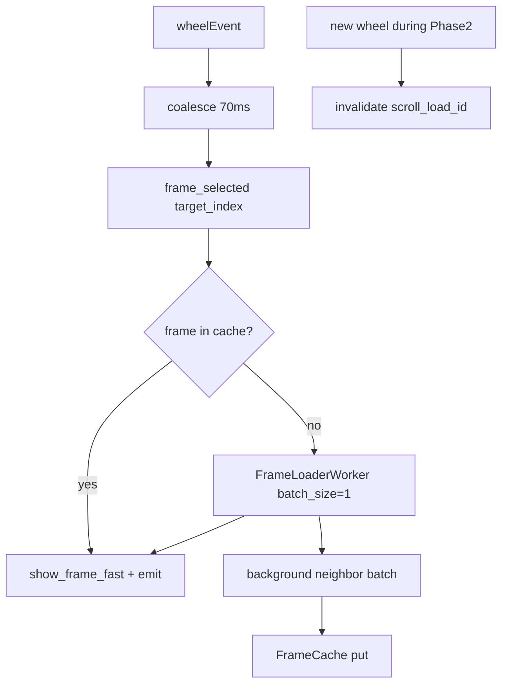

# DICOM Multiframe Scroll Performance — Design Specification (P0)

**Date:** 2026-06-29  
**Status:** Approved (P0 scope)  
**Type:** Performance / UX  
**Domain:** DICOM multiframe (JPEG / JPEG-2000) wheel scroll on low-end and high-end systems  
**Related:**
- [`2026-06-29-dicom-mp4-lazy-loading.md`](../plans/2026-06-29-dicom-mp4-lazy-loading.md)
- [`2026-06-29-playback-prefetch-design.md`](2026-06-29-playback-prefetch-design.md)

---

## 1. Executive Summary

Wheel scroll on DICOM multiframe cine (JPEG / JPEG-2000) feels sluggish on weak hardware because **every wheel tick** triggers a new `FrameLoaderWorker` batch (`batch_size=10`) and a full `show_frame` UI path. Playback already has adaptive prefetch; scroll does not.

**P0 fix:** coalesce wheel events, decode the **target frame first**, prefetch a small adaptive neighborhood in the background, cancel stale work, and use a lightweight display path during scroll. No changes to DICOM fragment parsing (BOT / JPEG-2000 index) in this phase.

---

## 2. Goals and Non-Goals

### 2.1 Goals

| Goal | Success criterion |
|------|-------------------|
| Responsive wheel on JPEG DICOM | Target frame visible within **150 ms** (cache miss) on low-end reference HW |
| Cache-hit scroll | Frame swap within **16 ms** when frame already in `FrameCache` |
| No decode storms | Fast wheel flick produces **one** target decode per coalesced burst, not one per tick |
| Cross-platform | Same logic on Linux and Windows (Qt timer + thread pool) |
| Memory bounded | Scroll prefetch radius respects existing `FrameCache` LRU eviction |

### 2.2 Non-Goals (P0 — explicitly deferred to P1)

- Basic Offset Table (BOT) / per-frame fragment index in `DicomSession`
- Removing `_decode_pydicom_fallback` full-cine decode
- MP4 scroll optimizations (keyframe index)
- GPU-aware profiler
- Playback timing compensation bug (`_last_frame_shown_at`) — separate small fix, not required for scroll P0
- Scroll debounce for timeline slider (only mouse wheel in P0)

---

## 3. Current State Diagnosis

### 3.1 Scroll flow today

```
ViewerWidget._handle_wheel
  → frame_selected.emit(new_index)          # immediate, every tick
  → AppController._on_state_changed
  → _request_frame_if_needed
  → FrameLoaderWorker(frame_index=target, batch_size=10)
  → DicomSession.read_frame(i) × up to 10
  → _on_batch_frame_loaded → frame_loaded
  → MainWindow._on_frame_loaded → show_frame (full UI path)
```

### 3.2 Root causes (confirmed by code review + unit tests)

| ID | Issue | Scroll impact |
|----|-------|---------------|
| S1 | No wheel debounce | Overlapping batch workers on fast scroll |
| S2 | Fixed `batch_size=10` (`_BATCH_LOAD_SIZE`) | 10× JPEG decode before user sees target on weak CPU |
| S3 | Batch always forward from target | Backward jump still prefetches forward frames |
| S4 | `show_frame` on scroll (not `show_frame_fast`) | Panel layout + doppler restore every frame |
| S5 | Scroll and playback share thread pool without priority | Playback prefetch can starve scroll target |
| S6 | `PlaybackConfig.min_buffer` unused | No adaptive threshold for scroll health |

### 3.3 What already works

- Lazy first-frame open (`DicomDecodeWorker.first_frame_only`)
- `FrameCache` sparse store + LRU via `set_current`
- Thread-local `DicomSession` in `FrameLoaderWorker` batch path
- Cache hit path in `_request_frame_if_needed` → `_emit_cached_frame` (fast when frame resident)

---

## 4. Target Architecture (P0)



### 4.1 Components

| Component | Responsibility |
|-----------|----------------|
| `ViewerWidget` | Wheel debounce timer; emit `frame_selected` once per burst |
| `AppController` | Two-phase scroll load; `scroll_load_id` cancellation; cache-first |
| `MainWindow` | `show_frame_fast` during scroll burst; full `show_frame` after scroll settles |
| `system_profiler.PlaybackConfig` | Add `scroll_batch_size`, `scroll_debounce_ms`; document `min_buffer` use |
| `FrameLoaderWorker` | Unchanged API — caller sets `batch_size` per phase |

### 4.2 Adaptive constants

Extend `PlaybackConfig` (values detected at startup, same low/high split as playback):

| Parameter | Low-end | High-end | Purpose |
|-----------|---------|----------|---------|
| `scroll_debounce_ms` | 80 | 50 | Wheel coalesce window |
| `scroll_batch_size` | 3 | 8 | Neighbor prefetch after target |
| `min_buffer` | 2 | 5 | Min loaded frames ahead before optional neighbor prefetch |
| `prefetch_radius` | (existing) | (existing) | Cap neighbor window |

Low-end detection unchanged: `cores ≤ 4` OR `ram ≤ 16 GB`.

### 4.3 Two-phase scroll decode

**Phase 1 (priority):** `FrameLoaderWorker(batch_size=1, frame_index=target)`  
- On completion: emit target frame immediately, update `FrameCache`, `set_current(target)`.

**Phase 2 (background):** only if scroll settled (no newer `scroll_load_id`) and `loaded_ahead(target) < scroll_batch_size`  
- `FrameLoaderWorker(batch_size=scroll_batch_size, frame_index=target+1)`  
- Results stored in cache only; no UI emit unless target changes.

**Cancellation:** increment `scroll_load_id` on each new target request; workers check ID in callbacks (same pattern as `_batch_load_id` / `_prefetch_load_id`).

### 4.4 Display path

| Condition | Display |
|-----------|---------|
| `is_playing` | existing `show_frame_fast` (unchanged) |
| Wheel scroll in progress (`_scroll_active`) | `show_frame_fast` |
| Scroll settled ≥ `scroll_debounce_ms` | one `show_frame` + overlay/doppler restore |
| Doppler tool active OR instance changed | always `show_frame` |

`_scroll_active` flag in `AppController` or `MainWindow`, cleared by single-shot timer after last wheel event.

### 4.5 Interaction with playback prefetch

- When `is_playing`: scroll path unchanged from playback (`_advance_playback`); wheel may still seek — pause playback first (existing behavior).
- When not playing: scroll Phase 1 **preempts** playback prefetch (`_invalidate_prefetch()` on new scroll target).
- Do not start Phase 2 while `_prefetch_load_id != 0` unless prefetch is invalidated.

---

## 5. Error Handling

| Case | Behavior |
|------|----------|
| Phase 1 decode fails | `frame_load_failed` status; keep previous frame visible |
| Phase 2 fails | Silent (cache best-effort); status optional debug log |
| Stale worker completes | Ignore via `scroll_load_id` / `batch_load_id` mismatch |
| Frame evicted before display | Re-trigger Phase 1 for target |

---

## 6. Testing Strategy

### 6.1 Unit tests (required)

| Test file | Cases |
|-----------|-------|
| `test_scroll_debounce.py` | Multiple wheel events → one `frame_selected`; timer fires with last index |
| `test_scroll_two_phase_load.py` | Phase 1 `batch_size=1` started first; Phase 2 only after Phase 1; cancel on new target |
| `test_system_profiler.py` | New fields present in low/high profiles |
| `test_app_controller_dicom_cache.py` | Cache hit on scroll skips worker |

### 6.2 Manual QA (checklist)

1. Open JPEG multiframe DICOM (≥ 30 frames) on weak PC — fast wheel forward/backward.
2. Verify no empty viewer during scroll.
3. After scroll stops, doppler calibration and overlays restore within one frame.
4. Repeat on Linux and Windows.
5. Playback (Space) still smooth after scroll P0.

### 6.3 Out of scope for P0 CI

- Real JPEG-2000 file benchmarks
- Profiling harness in CI

---

## 7. File Map

| File | Action |
|------|--------|
| `src/echo_personal_tool/presentation/viewer_widget.py` | Wheel debounce |
| `src/echo_personal_tool/application/app_controller.py` | Two-phase scroll load, scroll_load_id, scroll_active |
| `src/echo_personal_tool/presentation/main_window.py` | Conditional show_frame_fast |
| `src/echo_personal_tool/infrastructure/system_profiler.py` | scroll_debounce_ms, scroll_batch_size |
| `tests/unit/test_scroll_debounce.py` | Create |
| `tests/unit/test_scroll_two_phase_load.py` | Create |

---

## 8. Spec Self-Review

- [x] No TBD / placeholder sections
- [x] Scope limited to P0 (no BOT / JPEG-2000 index)
- [x] Consistent with existing `PlaybackConfig` / `FrameLoaderWorker` patterns
- [x] Success metrics measurable manually
- [x] Playback path explicitly preserved
- [x] Single implementation plan scope (one subsystem: scroll UX layer)

---

## 9. Approval

**Approved:** P0 only (user confirmation 2026-06-29). P1 (BOT / fragment index) deferred.
