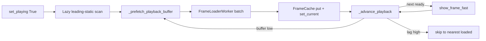

# Cine Playback Prefetch — Design Specification

**Date:** 2026-06-29  
**Status:** Approved  
**Type:** Performance / UX  
**Domain:** DICOM multiframe + MP4 cine playback on low-end hardware  
**Related:** [`2026-06-29-dicom-mp4-lazy-loading.md`](../plans/2026-06-29-dicom-mp4-lazy-loading.md) (P0 partial, P1/P2 gaps)

---

## 1. Executive Summary

Cine playback on weak systems (AMD FX-4350, 16 GB RAM, GTX 660) stutters because the app loads **one frame at a time** during play. Scroll path already uses batch load (`batch_size=10`), but playback does not. The fix is a **symmetric prefetch pipeline** for DICOM and MP4: keep N frames ahead in `FrameCache`, advance only when the next frame is ready, and skip forward on critical lag.

---

## 2. Goals and Non-Goals

### 2.1 Goals

| Goal | Success criterion |
|------|-------------------|
| Smooth DICOM playback | No freeze > 200 ms between frames after 1 s warm-up (JPEG-2000 cine) |
| Smooth MP4 playback | ≥ 20 fps sustained after warm-up on GTX 660 |
| Symmetric formats | Same controller logic for DICOM and MP4 |
| Resume latency | Pause → Play < 500 ms |
| Memory bounded | ≤ `2 × PREFETCH_RADIUS + EVICT_WINDOW` decoded frames resident |

### 2.2 Non-Goals (phase 1)

- MP4 keyframe index / disk-cached index
- Dedicated producer-consumer decode thread
- Decode timeout (30 s) — P3 from lazy-loading plan
- Full `system_profiler` (GPU VRAM, thread pools) — only playback constants

---

## 3. Current State Diagnosis

### 3.1 Playback flow today

```
_advance_playback → next in cache? → step_frame
                  → else → FrameLoaderWorker (1 frame) → wait decode → QTimer(33ms) → repeat
```

Decode time (50–150 ms/frame on weak CPU) exceeds frame interval (33 ms) → permanent lag.

### 3.2 Known bugs in scope

| Bug | Impact |
|-----|--------|
| `_batch_target_frame` never updated | Batch scroll shows wrong frame |
| `_leading_static_frames` only set on full decode | Play starts on static lead-in in lazy mode |
| `set_current()` never called from controller | Eviction not centered on playback position |
| Prefetch exists in `FrameCache` but only evicts | Does not load frames |

---

## 4. Target Architecture



### 4.1 Components

| Component | Responsibility |
|-----------|----------------|
| `system_profiler.py` | `PlaybackConfig` dataclass + `detect_playback_config()` |
| `AppController` | Prefetch orchestration, lag skip, lazy leading-static, timing |
| `FrameCache` | `loaded_ahead()`, `nearest_loaded_ahead()`, `set_current` on display |
| `FrameLoaderWorker` | Unchanged — batch sequential decode already implemented |
| `viewer_widget` | Unchanged — `show_frame_fast` already used during play |

### 4.2 Adaptive constants

| Parameter | Low-end (`cores ≤ 4` OR `ram ≤ 16 GB`) | High-end |
|-----------|----------------------------------------|----------|
| `prefetch_radius` | 3 | 10 |
| `min_buffer` | 2 | 5 |
| `batch_size` | 3 | 8 |
| `max_lag_frames` | 2 | 4 |
| `evict_window` | 30 | 40 |

---

## 5. Data Flow

### 5.1 Play start

1. `set_playing(True)`
2. If `_leading_static_frames[path]` missing → `_scan_leading_static_lazy()` (batch load frames 0–7, diff vs frame 0)
3. If `leading > 0` → jump to `leading + 1`
4. `_prefetch_playback_buffer(current_index)`
5. `_advance_playback()`

### 5.2 Frame advance (both formats)

1. `next_idx = (current + 1) % total`
2. If `is_loaded(next_idx)` → `set_current(next_idx)`, `step_frame(1)`, schedule next tick with `max(0, interval - elapsed)`, `_prefetch_playback_buffer`
3. Elif `loaded_ahead(current) > max_lag` → skip to `nearest_loaded_ahead(current)`
4. Elif prefetch not running → `_prefetch_playback_buffer(current)` (hold frame)
5. Else wait for prefetch callback

### 5.3 Pause / seek

- Pause: increment `_prefetch_request_id` (invalidate in-flight prefetch)
- Seek: same invalidation + prefetch from new index

### 5.4 Timing model

- **Old:** decode completes → always wait full `frame_time_ms` → advance
- **New:** if frame was cached before tick, advance immediately; timer compensates for display time already spent

---

## 6. Error Handling

| Situation | Behavior |
|-----------|----------|
| Prefetch worker fails | Status message; continue with loaded frames |
| All prefetch fails during play | Auto-pause + user message |
| Stale `request_id` after pause/seek | Discard batch results silently |
| STE `require_full_cine()` | Unchanged — separate full-decode path |

---

## 7. Testing

### 7.1 Unit

- `test_system_profiler.py` — low/high-end config values
- `test_frame_cache.py` — `loaded_ahead`, `nearest_loaded_ahead`
- `test_playback_prefetch.py` — prefetch trigger, cancel on pause, lag skip, lazy leading-static

### 7.2 Manual

- DICOM 500+ frame JPEG-2000, GTX 660: 30 s play, no freeze > 200 ms
- MP4 2000 frames: ≥ 20 fps after warm-up
- Pause/Play/Seek/Loop on both formats

---

## 8. Risks

| Risk | Mitigation |
|------|------------|
| RAM spike from prefetch | Adaptive `prefetch_radius`; `set_current` eviction |
| Batch load blocks thread pool | Single prefetch worker; scroll uses separate `_pending_load_id` |
| Loop boundary gap | Prefetch wraps to frame 0 when near end |

---

## 9. Phase 2 (deferred)

- MP4 keyframe index for random seek during scroll
- Dedicated sequential decode thread
- Decode timeout + cancellation tokens
